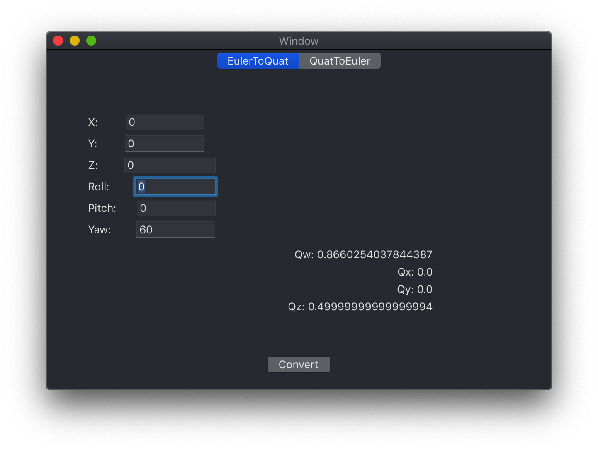

#Introduction

This project is a convertor for transform bewteen `Quaternion and Euler`, which is developed by swift4.x, running on MacOS 10.14.2.

The convertor provides a Cocoa interface to use. It would be easy to use.
Since the author is not authorized developer of Apple, so no built dmg and release version.

